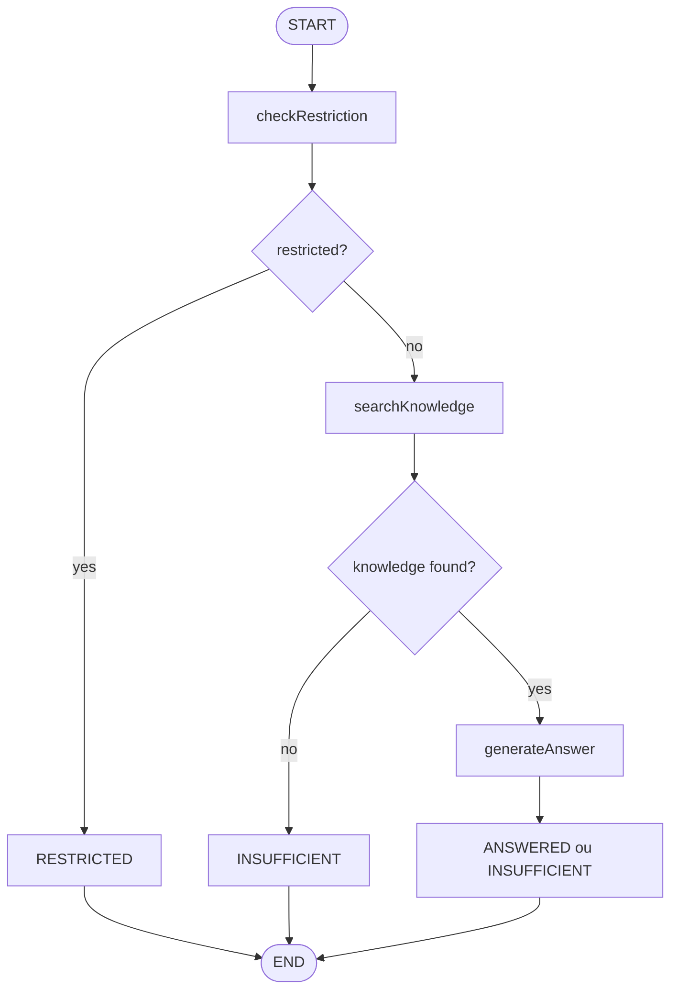

# Squadfly Knowledge Agent

Backend em NestJS para consulta de uma base de conhecimento por organização.

Cada organização tem seus próprios documentos e tópicos restritos. A API identifica a organização pelo header `X-Organization-Key`, busca apenas os dados dessa organização e usa um fluxo com LangGraph para decidir se pode responder, se deve bloquear ou se falta conhecimento.

## Stack

- NestJS + TypeScript
- PostgreSQL
- Drizzle ORM
- LangGraph
- OpenAI
- Jest
- Bruno
- Docker

## Como rodar

Crie o `.env`:

```bash
cp .env.example .env
```

Preencha a chave da OpenAI:

```env
OPENAI_API_KEY=
```

Suba a aplicação:

```bash
docker compose up -d --build
```

Rode migrations e seed:

```bash
docker compose exec api npm run db:migrate
docker compose exec api npm run db:seed
```

A API fica disponível em:

```text
http://localhost:3000
```

Testes:

```bash
docker compose exec api npm test
```

Para parar:

```bash
docker compose down
```

Para remover também os dados do banco:

```bash
docker compose down -v
```

## Endpoint

```http
POST /agent/query
X-Organization-Key: alpha-test-key
Content-Type: application/json
```

```json
{
  "question": "Quantos dias de férias os funcionários possuem?"
}
```

Exemplos de chaves criadas no seed:

- `alpha-test-key`
- `beta-test-key`

A API Key aqui é só uma simplificação para identificar a organização no teste. Em um projeto real, isso seria substituído por autenticação e autorização mais completas.

## Fluxo

```text
Controller
  -> AgentService
  -> AgentGraphService
  -> KnowledgeService / LlmService
  -> PostgreSQL / OpenAI
```

O controller só recebe a request e delega. A lógica do agente fica no LangGraph, e as consultas ao banco ficam nos services.

## LangGraph



Nodes:

- `checkRestriction`
- `restrictedResponse`
- `searchKnowledge`
- `insufficientResponse`
- `generateAnswer`

O grafo é montado uma vez no `AgentGraphService`. A cada pergunta, muda apenas o state com `organizationId` e `question`.

## Banco

Tabelas principais:

- `organizations`
- `knowledge_documents`
- `restricted_topics`

Os documentos e tópicos restritos possuem `organization_id`.

Isso é importante porque toda consulta filtra direto no banco pela organização atual. A aplicação não busca documentos de outras organizações para filtrar depois.

## Isolamento entre organizações

O cliente envia somente:

```http
X-Organization-Key
```

A API encontra a organização correspondente e coloca o `organizationId` no state do grafo.

Depois disso:

- tópicos restritos são buscados por `organization_id`;
- documentos são buscados por `organization_id`;
- o LLM recebe somente documentos da organização atual.

No seed, Alpha tem 30 dias de férias e Beta tem 20. A mesma pergunta deve retornar respostas diferentes dependendo da chave usada.

## Busca e resposta

A busca de documentos é propositalmente simples: a pergunta é quebrada em termos e o PostgreSQL procura esses termos com `ILIKE` no título e conteúdo dos documentos.

Se nada for encontrado, a resposta é `INSUFFICIENT`.

Quando encontra documentos, o LLM recebe apenas esses documentos como contexto. O prompt pede para responder somente com base no contexto e retornar `canAnswer=false` se não houver informação suficiente.

## Bruno

A coleção está em:

```text
bruno/
```

Use o ambiente `Local`, que já vem com:

```text
baseUrl=http://localhost:3000
alphaApiKey=alpha-test-key
betaApiKey=beta-test-key
```

Requests incluídas:

- conhecimento disponível na Alpha;
- conhecimento disponível na Beta;
- conteúdo restrito na Alpha;
- conteúdo restrito na Beta;
- conhecimento insuficiente;
- API Key inválida;
- isolamento Alpha;
- isolamento Beta.

## Testes

Os testes unitários ficam em `src/agent/agent-graph.service.spec.ts`.

Eles mockam o `LlmService` e validam os principais caminhos do grafo:

- pergunta restrita não executa busca de conhecimento;
- sem documentos retorna `INSUFFICIENT`;
- documento relevante retorna `ANSWERED`;
- documento encontrado ainda pode retornar `INSUFFICIENT`;
- Alpha não usa documentos da Beta;
- Beta não usa documentos da Alpha.

